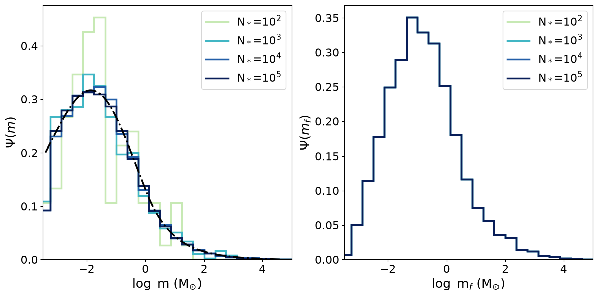

<p align="center">
  <picture>
    <source media="(prefers-color-scheme: dark)" srcset="docs/assets/ocotillopmf-logo-dark.svg">
    <source media="(prefers-color-scheme: light)" srcset="docs/assets/ocotillopmf-logo-light.svg">
    
  </picture>
  <br>
  <a href="https://github.com/AstroBrandt/OcotilloPMF/actions/workflows/tests.yml"></a>
  <a href="LICENSE"></a>
  <a href="https://pypi.org/project/ocotillopmf/"></a>
  <a href="https://pypi.org/project/ocotillopmf/"></a>
  <a href="https://doi.org/10.3847/1538-4357/aaaae2"></a>
</p>

A Python package for sampling the protostellar mass function (PMF) — the
joint distribution of current and final stellar mass during star formation —
under a given accretion model, plus tools for computing the resulting
accretion and photospheric luminosities. The underlying class is based on the older Python2 code from [Gaches & Offner (2018)](https://scixplorer.org/abs/2018ApJ...854..156G/abstract). It built upon the underlying Protostellar Mass Function (PMF) and Protostellar Luminosity Function (PLF) formalisms of [McKee & Offner (2010)](https://scixplorer.org/abs/2010ApJ...716..167M/abstract) (MO10) and [Offner & McKee (2011)](https://scixplorer.org/abs/2011ApJ...736...53O/abstract) (OM11), respectively.

The original version of the code was a monolithic Python2 script written "to work". The new version has been updated to Python3 standards and optimized for much easier use and quicker calculations.

## Installation

```bash
pip install ocotillopmf
```

To also run the example notebooks (requires matplotlib, seaborn, jupyter):

```bash
pip install "ocotillopmf[examples]"
```

## Quickstart

```python
from ocotillopmf import PowerLawAccrete, PMF

# Define a tapered turbulent-core accretion model: PowerLawAccrete(j, jf, m0, deltan1)
accretion = PowerLawAccrete(0.5, 0.75, 3.6e-5, deltan1=1.0)

# Build a PMF sampler on top of it (defaults to a Chabrier 2005 IMF)
pmf = PMF(accretion)

# Sample the bivariate (current mass, final mass) distribution for N protostars
m, mf = pmf.PhiInvertSample(N=10_000)

# Instantaneous accretion rate for each sampled star, in Msun/yr
mdot = accretion.acc(m, mf)
```
The parameters that go into `PowerLawAccrete(j, jf, m0, deltan1)` define the assumed steady-state accretion model. See the MO10 and OM11 papers for details.

See [examples/protoclusterGen.ipynb](examples/protoclusterGen.ipynb) for a
full walkthrough, including luminosity calculations via `LuminosityObject`
and convergence checks on the sampler. The cluster generate was vectorized, and has been tested for clusters up to 100,000 protostars. The PMF sampler converges quickly to the analytic, as shown below.


\[**Caption**\] _Left_: Histogram distribution of the current protostar mass of generated clusters between 100 and 100,000 protostars. _Right_: Histogram distribution of the final masses. Note that they overlap since this is hard defined by a user-prescribed IMF, which is weighted then by the formation timescale.


## License

BSD-3-Clause

## Author

Brandt Gaches (brandt.gaches@uni-due.de) \
Emmy Noether Junior Group Leader \
University of Duisburg-Essen \
[brandt.gaches.space](https://www.brandt-gaches.space)
